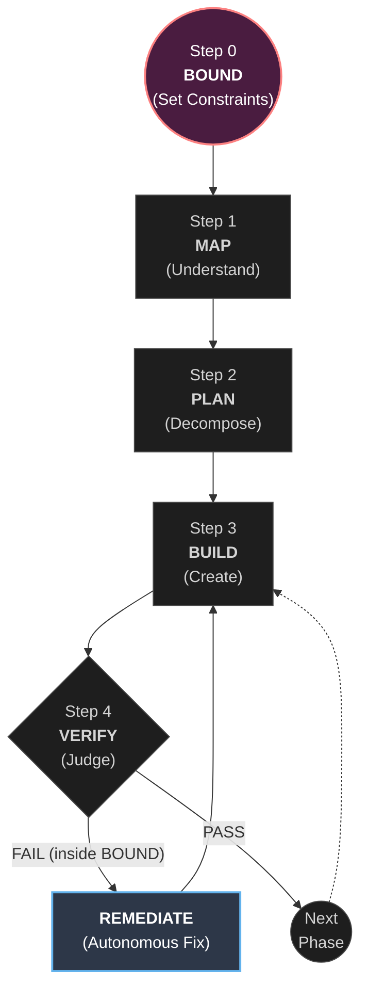

# Ouro Loop


> **"To grant an entity absolute autonomy, you must first bind it with absolute constraints."**

[](https://opensource.org/licenses/MIT)
[](https://pypi.org/project/ouro-loop/)
[](https://www.python.org/downloads/)
[](https://github.com/VictorVVedtion/ouro-loop/actions/workflows/test.yml)
[]()
[]()

## What is Ouro Loop?

**Ouro Loop** is an open-source framework that gives AI coding agents (Claude Code, Cursor, Aider, Codex) a structured autonomous loop with runtime-enforced guardrails. It implements **bounded autonomy** — the developer defines absolute constraints (DANGER ZONES, NEVER DO rules, IRON LAWS) using the BOUND system, then the agent loops autonomously through Build → Verify → Self-Fix cycles. When verification fails, the agent doesn't ask for help — it consults its remediation playbook, reverts, tries a different approach, and reports what it did. Constraints are enforced at the runtime level through Claude Code Hooks (exit 2 hard-block), not by relying on the agent's "good behavior." Inspired by Karpathy's [autoresearch](https://github.com/karpathy/autoresearch), extended from ML to general software engineering. Zero dependencies, pure Python 3.10+.

| | |
|---|---|
| **What it does** | Let AI agents code overnight without breaking things |
| **How it works** | Define boundaries (BOUND) → AI loops: Build → Verify → Self-Fix |
| **What you get** | `program.md` (method) + `framework.py` (runtime) + `sentinel.py` (24/7 review) + 5 hooks (enforcement) |
| **Requirements** | Python 3.10+, Git, any AI agent. Zero dependencies. `pip install ouro-loop` |

### Is Ouro Loop for you?

**This is for you if:**
- You want to let an AI agent run autonomously for hours (overnight builds, long refactors)
- Your project has files that must never be touched without review (payments, auth, consensus)
- You've experienced AI agents hallucinating paths, breaking constraints, or getting stuck in loops
- You want auditable, structured autonomous development — not "vibe and pray"

**This is NOT for you if:**
- You're building a quick prototype or hackathon project (BOUND setup overhead isn't worth it)
- You're writing single-file scripts (the methodology overhead exceeds the benefit)
- You want real-time interactive coding (Ouro Loop is designed for "set it and let it run")

### The Problem with Unbound AI Agents

In the era of "vibe coding," unbound AI agents hallucinate file paths, break production constraints, regress architectural patterns, and get stuck in infinite fix-break loops. The current solution — pausing to ask humans — negates the promise of autonomous coding.

### The Solution: Bounded Autonomy

Ouro Loop formally introduces **The Event Horizon**: the developer establishes absolute constraints (Iron Laws, Danger Zones). The AI Agent is granted full autonomy to continuously build, verify, and self-correct within that boundary — never crossing into catastrophic failure. When something breaks inside the boundary, the agent **doesn't ask for help** — it consults its remediation playbook, reverts, tries a different approach, and reports what it did.

---

## How It Works

The repo is deliberately kept small. Only three files matter:

- **`program.md`** — the methodology instructions. Defines the six-stage loop (BOUND, MAP, PLAN, BUILD, VERIFY, LOOP) and the autonomous remediation rules. Point your agent here and let it go. **This file is iterated on by the human**.
- **`framework.py`** — lightweight runtime for state tracking, verification gates, and logging. The agent uses this CLI to check its own work. **This file can be extended by the agent**.
- **`prepare.py`** — project scanning and initialization. Creates the `.ouro/` state directory. Not modified.



When verification fails, the agent does *not* ask for human help. It consults `modules/remediation.md`, decides on a fix, reverts/retries, and loops — so long as it hasn't breached the outer edge of the BOUND. Read [The Manifesto](MANIFESTO.md) for the deep-dive on Precision Autonomy.

---

## Quick Start

**Requirements:** Python 3.10+, Git, any AI coding agent.

### 1. Install Ouro Loop

**Option A — pip (recommended):**

```bash
pip install ouro-loop
```

**Option B — clone:**

```bash
git clone https://github.com/VictorVVedtion/ouro-loop.git ~/.ouro-loop
```

### 2. Scan your project

```bash
cd /path/to/your/project

# If installed via pip:
python -m prepare scan .

# If cloned:
python ~/.ouro-loop/prepare.py scan .
```

This shows you what Ouro Loop sees:

```
============================================================
  Ouro Loop — Project Scan
============================================================
  Project:    my-payment-service
  Types:      Python
  Files:      42       Lines:     3,200

  Languages:
    Python                  35 files  ###############
    SQL                      7 files  #######

  CLAUDE.md:  Not found
  BOUND:      Not defined
  Tests:      Found
  CI:         Found

  Recommendations:
    1. Define BOUND (DANGER ZONES, NEVER DO, IRON LAWS) before building
    2. Create CLAUDE.md with BOUND section
============================================================
```

### 3. Initialize and draw the boundaries

```bash
# If installed via pip:
python -m prepare init .           # Creates .ouro/ state directory
python -m prepare template claude .  # Generates CLAUDE.md template

# If cloned:
python ~/.ouro-loop/prepare.py init .
python ~/.ouro-loop/prepare.py template claude .
```

Edit `CLAUDE.md` to define your project's actual boundaries. Here's what a real BOUND looks like:

```markdown
## BOUND

### DANGER ZONES
- `src/payments/calculator.py` — financial calculations, penny-level precision
- `migrations/` — database schema, irreversible in production

### NEVER DO
- Never use float for monetary values — always Decimal
- Never delete or rename migration files
- Never commit without running the test suite

### IRON LAWS
- All monetary values use Decimal with 2-digit precision
- All API responses include request_id field
- Test coverage for payment module never drops below 90%
```

See `examples/` for complete BOUND definitions and **real session logs** showing the methodology in action:

- [**Blockchain L1**](examples/blockchain-l1/) — BOUND for consensus/p2p, plus a [real session log](examples/blockchain-l1/session-log.md) where the agent tested 5 hypotheses, autonomously remediated 4 failures, and found a root cause that was architectural (HTTP routing), not code-level.
- [**Consumer Product**](examples/consumer-product/) — BOUND for audio/sync, plus a [real session log](examples/consumer-product/session-log.md) where ROOT_CAUSE gate caught a lazy fix and pushed the agent toward a genuinely better solution.
- [**Financial System**](examples/financial-system/) — DANGER ZONES around payments, Decimal precision IRON LAWS.
- [**ML Research**](examples/ml-research/) — autoresearch-style single-metric optimization reframed as BOUND.

### 4. Point your AI agent and go

Spin up Claude Code, Cursor, Aider, or any AI coding agent in your project and prompt:

```
# If installed via pip:
Read program.md from $(python -c "import framework; print(framework.__file__)" | xargs dirname)
and the CLAUDE.md in this project. Start the Ouro Loop for this task: [your task].

# If cloned:
Read program.md from ~/.ouro-loop/ and the CLAUDE.md in this project.
Let's start the Ouro Loop for this task: [your task].
```

The `program.md` file is essentially a lightweight "skill" — it tells the agent how to work within your boundaries. The agent will read your BOUND, MAP the problem, PLAN phases, BUILD incrementally, VERIFY through multi-layer gates, and LOOP feedback back into BOUND.

---

## The Runtime CLI

`framework.py` is the state machine and verification gatekeeper. If installed via pip, use the `ouro` command:

```bash
ouro status .         # Where are we in the loop?
ouro bound-check .    # Are DANGER ZONES / IRON LAWS defined?
ouro verify .         # Run all verification gates (Layer 1 + 2 + 3)
ouro log PASS --path . --notes "phase 1 done"  # Record result + reflective log
ouro advance .        # Move to next phase
ouro reflect .        # View three-layer reflective log (WHAT/WHY/PATTERN)
```

Or use `python framework.py` directly if cloned. Run `ouro --help` for all commands.

**Verify** runs three-layer gate checks — 5 gates + self-assessment + human review triggers:

```
==================================================
  Ouro Loop — Verification
==================================================
  Layer 1 — Gates:
    [+] EXIST           CLAUDE.md exists
    [+] RELEVANCE       3 files changed
    [!] ROOT_CAUSE      Hot files: src/payments/calc.py
    [+] RECALL          BOUND loaded: 2 zones, 3 prohibitions, 2 laws
    [+] MOMENTUM        5 recent commits

  Layer 2 — Self-Assessment:
    [+] bound_compliance BOUND section found
    [+] tests_exist     Test files found

  Layer 3 — External Review: Not required

  Overall: PASS
==================================================
```

Layer 3 triggers human review when: changes touch a DANGER ZONE, 3+ consecutive RETRYs, or architectural complexity is detected.

**When verification fails**, the agent autonomously remediates and reports what it did:

```
[REMEDIATED] gate=ROOT_CAUSE action=revert_and_retry
  was: editing src/payments/calc.py for the 4th time (same TypeError)
  did: reverted to commit a1b2c3d, re-analyzed from scratch
  now: trying middleware pattern instead
  bound: no DANGER ZONE touched, no IRON LAW affected
```

Results are logged to `ouro-results.tsv` for full auditability:

```
phase   verdict   bound_violations   notes
1/3     PASS      0                  transactions endpoint + tests
2/3     RETRY     0                  ROOT_CAUSE warning, fixing
2/3     PASS      0                  fixed after retry
3/3     PASS      0                  validation complete
```

### Reflective Log — Three-Layer Self-Awareness

Every `ouro log` writes a structured JSONL entry (`.ouro/reflective-log.jsonl`) that the agent can read at the start of each iteration to understand its own behavioral patterns:

```
ouro reflect .
============================================================
  Ouro Loop — Reflective Log (last 3 entries)
============================================================

  #3 [2026-03-15T12:30:00]
  WHAT: BUILD 2/5 → FAIL (overall: REVIEW)
        Gates: EXIST[+] RELEVANCE[!] ROOT_CAUSE[!] RECALL[+] MOMENTUM[+]
        DZ contact: src/payments/stripe.py (zone: src/payments/)
  WHY:  complexity=complex | Touches DANGER ZONE: src/payments/stripe.py
        notes: payment validation failed
  PATTERN: velocity=DECELERATING | failures=2 | retry_rate=40%
        hot: src/payments/stripe.py, src/payments/types.py
  >> DRIFT: working in DANGER ZONE — extra caution required
  >> HOT FILES: src/payments/stripe.py — possible symptom-chasing
============================================================
```

Each entry has three layers:
- **WHAT** — facts: verdict, gate statuses, changed files, DANGER ZONE contacts
- **WHY** — decisions: complexity routing, review triggers, BOUND state
- **PATTERN** — self-awareness: stuck loops, velocity trends, hot files, drift signals

The agent reads this log to avoid repeating past mistakes without needing to replay the full session.

---

## Claude Code Hooks — Automatic BOUND Enforcement

Ouro Loop includes 5 hooks that enforce BOUND constraints at the tool level. When installed, the agent **physically cannot** edit DANGER ZONE files without user approval — no matter what instructions it receives.

```bash
# If cloned:
cp ~/.ouro-loop/hooks/settings.json.template .claude/settings.json
# Edit $OURO_LOOP_DIR paths in settings.json to point to ~/.ouro-loop

# If installed via pip — find the hooks directory:
python -c "import framework; from pathlib import Path; print(Path(framework.__file__).parent / 'hooks')"
# Then copy settings.json.template from that path
```

| Hook | Event | What it does |
|------|-------|-------------|
| `bound-guard.sh` | PreToolUse:Edit/Write | Parses CLAUDE.md DANGER ZONES, **blocks** edits to protected files (exit 2). Path-segment-aware matching. |
| `root-cause-tracker.sh` | PostToolUse:Edit/Write | Tracks per-file edit count, warns at 3+, strongly warns at 5+ |
| `drift-detector.sh` | PreToolUse:Edit/Write | Warns when touching 5+ directories (scope drift) |
| `momentum-gate.sh` | PostToolUse:Edit/Write/Read | Tracks read/write ratio, warns when stuck in analysis paralysis (3:1+ ratio) |
| `recall-gate.sh` | PreCompact | Re-injects BOUND into context before compression |

Verified in live Claude Code sessions:
- `framework.py` (DANGER ZONE): **BLOCKED** with exit 2, agent sees denial reason
- `hooks/bound-guard.sh` (DANGER ZONE): **BLOCKED** — hook protects itself
- `CONTRIBUTING.md` (safe): passed silently, zero overhead

This is what makes Ouro Loop different from instruction-only approaches: **BOUND is enforced by the runtime, not by the agent's good behavior.**

---

## Real Results from Autonomous Sessions

These results come from real Ouro Loop sessions on production codebases. Full session logs with methodology observations are available in `examples/`.

### Blockchain L1 — Consensus Performance Under Load

An AI agent was tasked with investigating why `precommit` latency spiked from 4ms to 200ms under transaction load on a 4-validator PBFT blockchain. Working inside a DANGER ZONE (`consensus/`):

- **5 hypotheses tested, 4 autonomous remediations** — the ROOT_CAUSE gate fired 4 times, each time correctly identifying that the agent was fixing symptoms, not the cause
- After 3 consecutive failed hypotheses, the 3-failure step-back rule kicked in: "stop fixing symptoms, re-examine the architecture" — which led to discovering the real root cause
- **Root cause was architectural, not code-level** — a single-node HTTP bottleneck was causing consensus-wide delays. The fix was a Caddy reverse proxy, not a code change
- **The agent caught its own flawed experiment** — when testing an alternative, it ran 4x full stress instead of 1x distributed. It identified the flaw before drawing wrong conclusions

| Metric | Before | After | Delta |
|--------|--------|-------|-------|
| Precommit (under load) | 100-200ms | 4ms | **-98%** |
| Block time (under load) | 111-200ms | 52-57ms | **-53%** |
| TPS Variance | 40.6% | 1.6% | **-96%** |
| SysErr rate | 0.00% | 0.00% | = (IRON LAW) |
| Blocks/sec (soak load) | ~8.0 | ~18.5 | **+131%** |

### Consumer Product — Lint Remediation in React/Next.js

A simpler session where the ROOT_CAUSE gate prevented a lazy fix: instead of suppressing ESLint errors, the agent was pushed toward genuinely better solutions (replacing `<a>` with Next.js `<Link>`, properly handling `useEffect` state patterns).

See the full session logs: [Blockchain L1](examples/blockchain-l1/session-log.md) | [Consumer Product](examples/consumer-product/session-log.md)

---

## Project Structure

```
program.md          — methodology instructions (human edits this)
framework.py        — runtime CLI: state, verification, logging, reflective log
prepare.py          — project scanning and initialization (not modified)
hooks/
  bound-guard.sh      DANGER ZONE enforcement (PreToolUse, exit 2 block)
  root-cause-tracker.sh  repeated-edit detection (PostToolUse)
  drift-detector.sh   scope drift warning (PreToolUse)
  momentum-gate.sh    read/write ratio tracking (PostToolUse)
  recall-gate.sh      BOUND re-injection on context compaction (PreCompact)
  settings.json.template  ready-to-use hooks configuration
modules/
  bound.md            Stage 0: define DANGER ZONES, NEVER DO, IRON LAWS
  map.md              Stage 1: understand the problem space
  plan.md             Stage 2: decompose into severity-ordered phases
  build.md            Stage 3: RED-GREEN-REFACTOR-COMMIT
  verify.md           Stage 4: three-layer verification gates
  loop.md             Stage 5: feedback closure
  remediation.md      autonomous remediation playbook
sentinel.py           24/7 autonomous code review module (partition scan, runner, dashboard)
ouro_templates/       distributable templates for CLAUDE.md, phase plans, sentinel
examples/             real-world BOUND definitions from five project types
tests/               507 tests covering all runtime logic
```

## Design Choices

- **Boundaries before code.** Define what must never break before writing any code. A financial system's NEVER DO list prevents more bugs than any test suite.
- **Autonomous remediation.** Unlike monitoring tools that detect-and-alert, Ouro Loop agents detect-decide-act-report. Like `autoresearch` auto-reverts when val_bpb regresses, Ouro Loop auto-remediates when verification fails — inside BOUND, no human permission needed.
- **Structured self-reflection.** Every iteration writes a three-layer log (WHAT/WHY/PATTERN) that the agent reads at the start of the next iteration. No raw session replay — just the facts, decisions, and detected behavioral patterns.
- **Three files that matter.** `program.md` (methodology), `framework.py` (runtime), `prepare.py` (init). Everything else is reference.
- **Zero dependencies.** Pure Python 3.10+. `pip install ouro-loop`. Works with any AI agent, any language, any project type.

## Comparison with autoresearch

| | autoresearch | ouro-loop |
|--|-------------|-----------|
| Core idea | Give AI a training loop, let it experiment | Give AI a methodology, let it guard |
| Human programs | `program.md` (experiment strategy) | `program.md` (dev strategy) + `CLAUDE.md` (boundaries) |
| AI modifies | `train.py` (model code) | Target project code + `framework.py` |
| Fixed constraint | 5-minute training budget | BOUND (DANGER ZONES, NEVER DO, IRON LAWS) |
| Core metric | val_bpb (lower is better) | Multi-layer verification (gates + self-assessment) |
| On failure | Auto-revert, try next experiment | Auto-remediate, try alternative approach |
| Read-only | `prepare.py` | `prepare.py` + `modules/` |

## Use Cases

Ouro Loop is designed for any scenario where you need an **AI agent to work autonomously for extended periods** without human babysitting:

- **Overnight autonomous development** — Define BOUND, start the agent, sleep. Wake up to a log of phases completed and verified, not a broken codebase.
- **Long-running refactoring** — Let the agent refactor a large codebase in phases, with verification gates ensuring nothing breaks between phases.
- **AI-assisted code review and remediation** — The agent identifies issues, fixes them, and verifies the fixes — all within defined safety boundaries.
- **Continuous integration with AI agents** — Plug Ouro Loop into your CI/CD pipeline to let agents handle build failures, test regressions, and dependency updates autonomously.
- **Multi-phase feature development** — Break complex features into severity-ordered phases. The agent handles CRITICAL changes first, then HIGH, then MEDIUM.
- **Production-safe AI coding** — For financial systems, blockchain infrastructure, medical software, and any domain where "move fast and break things" is unacceptable.

## Ouro Sentinel — 24/7 Autonomous Code Review

Sentinel is a built-in module that runs continuous, unattended code review loops on any project.

### Quick Start

```bash
pip install ouro-loop

cd your-project/
ouro-sentinel init .       # Scan → detect commands → generate partitions + config
ouro-sentinel install .    # Generate runner + dashboard scripts
make sentinel-start        # Start the 24/7 review loop
make sentinel-dashboard    # Watch live progress
```

### What `init` Does

1. **Scans** your project (languages, file count, LOC)
2. **Detects** build/test/lint commands (Go, Rust, Node, Python, Java, Ruby, C++)
3. **Generates partitions** — directories scored by risk (DANGER ZONE overlap → high)
4. **Renders** a Sentinel-specific `CLAUDE.md` with your BOUND rules inherited
5. **Creates** `.ouro/sentinel/` with state, config, empty findings log

### What the Runner Does

The runner (`sentinel-runner.sh`) is a bash daemon that:
- Launches Claude Code sessions in a loop with `--permission-mode bypassPermissions`
- Each session: reads state → picks highest-priority partition → scans → records findings → updates state
- Handles crashes: cleans up worktrees, validates state, backs up, restarts
- Rotates logs at 10MB, manages PID files, responds to SIGTERM/SIGINT

### Prerequisites

- **Claude Code CLI** (`claude`) must be in PATH — [install guide](https://claude.ai/claude-code)
- **Git** — sentinel uses git history for activity scoring and worktree-based fixes
- **Security note**: the runner uses `--permission-mode bypassPermissions` for unattended operation. Only run in trusted environments.

### Commands

```bash
ouro-sentinel init <path>        # Initialize sentinel for a project
ouro-sentinel partition <path>   # Regenerate partitions (after code changes)
ouro-sentinel status <path>      # Show iteration count, findings, coverage
ouro-sentinel install <path>     # Install runner + dashboard + Makefile targets
```

### Example

See `examples/sentinel-review/` for a complete Python project example with config.

## Works With

Ouro Loop is agent-agnostic. It works with any AI coding assistant that can read files and execute terminal commands:

- **[Claude Code](https://claude.ai/claude-code)** — Anthropic's CLI agent. Native `program.md` skill support.
- **[Cursor](https://cursor.sh)** — AI-powered IDE. Use `.cursorrules` to reference Ouro Loop modules.
- **[Aider](https://aider.chat)** — Terminal-based AI pair programmer.
- **[Codex CLI](https://github.com/openai/codex)** — OpenAI's coding agent.
- **[Windsurf](https://codeium.com/windsurf)** — Codeium's AI IDE.
- Any agent that can read Markdown instructions and run Python scripts.

## Related Projects

- **[karpathy/autoresearch](https://github.com/karpathy/autoresearch)** — The inspiration. Autonomous ML experiment loop. Ouro Loop extends this paradigm to general software engineering.
- **[anthropics/claude-code](https://claude.ai/claude-code)** — The AI agent Ouro Loop was primarily developed with.
- **[everything-claude-code](https://github.com/anthropics/courses)** — Comprehensive Claude Code skills and agents collection.

## FAQ

**Q: How is this different from just using `.cursorrules` or `CLAUDE.md`?**
A: `.cursorrules` and `CLAUDE.md` define static instructions that the agent can ignore. Ouro Loop adds a **runtime loop** — state tracking, multi-layer verification, autonomous remediation, and phase management. The agent doesn't just follow rules; it verifies compliance, detects drift, and self-corrects. Most importantly, BOUND constraints are enforced by runtime hooks (exit 2 hard-block), not by the agent's good behavior.

**Q: Can the agent really fix its own mistakes?**
A: Yes, within BOUND. When verification fails and the issue is inside the boundary (not a DANGER ZONE), the agent consults `modules/remediation.md` for a decision playbook: revert, retry with a different approach, or escalate. It reports what it did, not what it's thinking of doing. In a real blockchain session, the agent autonomously remediated 4 failures across 5 hypotheses and found a root cause that was architectural (HTTP routing), not code-level.

**Q: How do I add guardrails to Claude Code?**
A: Ouro Loop provides 5 Claude Code Hooks that enforce constraints at the tool level. Install them by copying `hooks/settings.json.template` to `.claude/settings.json` and editing the paths. The `bound-guard.sh` hook parses your CLAUDE.md DANGER ZONES and physically blocks edits to protected files. No agent can bypass exit code 2.

**Q: How do I let an AI agent code overnight?**
A: Define your BOUND (DANGER ZONES, NEVER DO, IRON LAWS) in CLAUDE.md, install the hooks, then tell the agent to read `program.md` and start the loop. The agent will iterate through Build → Verify → Self-Fix cycles autonomously. When verification fails, it remediates and retries. When it passes, it advances to the next phase. The loop continues until all phases are complete.

**Q: What is bounded autonomy in AI coding?**
A: Bounded autonomy is a paradigm where AI coding agents are granted full autonomous decision-making power within explicitly defined constraints. By defining the 20 things an agent cannot do (the BOUND), you implicitly authorize it to do the 10,000 things required to solve the problem. It's the middle path between human-in-the-loop (constant interruptions) and unbounded agents (unconstrained risk).

**Q: How to prevent AI agents from hallucinating file paths?**
A: Ouro Loop's EXIST verification gate checks whether referenced files, APIs, and modules actually exist before the agent proceeds. The `bound-guard.sh` hook also validates file paths against the project structure. If a file doesn't exist, the gate fails and triggers autonomous remediation — the agent corrects its reference instead of proceeding with hallucinated paths.

**Q: Can AI agents fix their own bugs autonomously?**
A: Yes — this is called autonomous remediation. When a verification gate fails, the agent doesn't alert a human. It reads its error logs, consults its remediation playbook, and takes action: revert, retry with a different approach, or escalate only if a DANGER ZONE is involved. The key constraint is BOUND — the agent can self-fix anything inside the boundary.

**Q: How to prevent context decay in long AI coding sessions?**
A: Ouro Loop addresses context decay through the RECALL verification gate and the `recall-gate.sh` hook. The gate monitors whether the agent can still recall key constraints. The hook fires before context compression (PreCompact event) and re-injects the BOUND section into the compressed context, preventing constraint amnesia during long sessions.

**Q: How long can the agent run autonomously?**
A: As long as phases remain. Each phase is independently verifiable, so the agent can run for hours across many phases. The NEVER STOP instruction in `program.md` keeps the loop going until all phases pass or an EMERGENCY-level issue is hit.

**Q: Do I need to install anything?**
A: `pip install ouro-loop` — or just clone the repo. Zero external dependencies. Pure Python 3.10+ standard library. Point your agent at `program.md`. Optionally install hooks for runtime enforcement.

**Q: When should I NOT use Ouro Loop?**
A: Don't use Ouro Loop for quick prototypes, hackathon projects, or single-file scripts — the BOUND setup overhead isn't worth it. It's also not designed for real-time interactive coding sessions. Ouro Loop shines when you need to "set it and let it run" — overnight builds, long-running refactors, and multi-phase autonomous development on codebases with critical constraints.

## Contributing

The most valuable contributions are **real-world bindings**. If you used Ouro Loop to bound an agent in a complex domain, submit a sanitized `CLAUDE.md` and `phase-plan.md` to `examples/`. See [CONTRIBUTING.md](CONTRIBUTING.md).

## Philosophy

By explicitly defining the 20 things an agent can *never* do (the BOUND), you implicitly authorize it to autonomously do the 10,000 things required to solve the problem. The constraint space defines the creative space. Read [The Manifesto](MANIFESTO.md) for the full deep-dive.

## License

MIT
