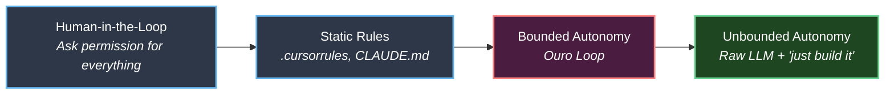

# Comparison

Ouro Loop occupies a specific position in the AI coding tool landscape: it is a methodology + runtime framework for **bounded autonomous coding sessions**. This page compares it against the common alternatives to help you decide when Ouro Loop is the right tool.

---

## The Autonomy Spectrum

| Approach | Autonomy | Safety | Overhead | Best For |
|----------|----------|--------|----------|----------|
| Human-in-the-loop | None | Highest | Very high (constant interrupts) | Pair programming, learning |
| Static rules | Low | Medium | Low | Quick projects, simple constraints |
| **Bounded autonomy (Ouro Loop)** | **High** | **High** | **Medium (one-time BOUND setup)** | **Overnight builds, critical systems** |
| Unbounded autonomy | Maximum | Lowest | None | Prototypes, throwaway code |

---

## Ouro Loop vs Static Rules (.cursorrules, CLAUDE.md)

Static rules files (`.cursorrules`, `CLAUDE.md` without Ouro Loop) define instructions that the agent is told to follow. They are simple, fast to set up, and effective for straightforward guidelines.

| Dimension | Static Rules | Ouro Loop |
|-----------|-------------|-----------|
| **Constraint enforcement** | Agent is *told* to follow rules | Agent is *blocked* from violating rules (exit 2 hooks) |
| **Self-correction** | Agent asks human when stuck | Agent remediates autonomously within BOUND |
| **Verification** | Manual or none | Multi-layer gates (EXIST, RELEVANCE, ROOT_CAUSE, RECALL, MOMENTUM) |
| **State tracking** | None | Phase progress, verification results, remediation log |
| **Loop feedback** | Rules are static | LOOP stage feeds lessons back into BOUND |
| **Setup cost** | Minutes | ~30 minutes for BOUND definition |
| **Best for** | Quick tasks, interactive coding | Long autonomous sessions, critical constraints |

!!! tip "When to use which"
    If your task takes less than 30 minutes and doesn't touch critical files, static rules are sufficient. If you want to let the agent run for hours without supervision, Ouro Loop's runtime enforcement and autonomous remediation justify the setup cost.

---

## Ouro Loop vs Monitoring Tools

Monitoring tools (linters, CI checks, observability platforms) detect issues and alert humans. They follow a **detect → alert → wait** pattern.

| Dimension | Monitoring Tools | Ouro Loop |
|-----------|-----------------|-----------|
| **Response to failure** | Alert human, wait | Agent remediates autonomously |
| **Action model** | Detect → Alert → Wait | Detect → Decide → Act → Report |
| **Human involvement** | Required for every issue | Only for DANGER ZONE violations |
| **Loop closure** | Human closes the loop | Agent closes the loop (VERIFY → REMEDIATE → BUILD) |
| **Prevention** | Post-hoc detection | Pre-emptive BOUND definition + runtime blocking |

Ouro Loop is complementary to monitoring tools, not a replacement. Use monitoring for production observability. Use Ouro Loop for development-time autonomous agent governance.

---

## Ouro Loop vs Raw LLM Prompting

Raw LLM prompting ("just tell the agent to build it") offers maximum speed and zero setup overhead. However, it provides no guardrails against the known failure modes of AI coding agents.

| Failure Mode | Raw LLM Prompting | Ouro Loop |
|-------------|-------------------|-----------|
| **Hallucinated file paths** | Common, no detection | EXIST gate checks file existence before proceeding |
| **Scope drift** | Common, no detection | RELEVANCE gate + drift-detector hook |
| **Stuck loops** | Common (edit-break-edit-break) | ROOT_CAUSE gate + root-cause-tracker hook |
| **Context decay** | Inevitable in long sessions | RECALL gate + recall-gate hook re-injects BOUND |
| **Breaking critical files** | Possible | DANGER ZONE hooks physically block edits (exit 2) |
| **No verification** | Agent decides when it's "done" | Multi-layer gates verify correctness at every phase |

---

## Ouro Loop vs autoresearch

Ouro Loop is directly inspired by Karpathy's autoresearch. Both share the paradigm of "human writes the program, AI executes within constraints."

| Dimension | autoresearch | Ouro Loop |
|-----------|-------------|-----------|
| **Domain** | ML experiments (training loops) | General software engineering |
| **Human programs** | `program.md` (experiment strategy) | `program.md` (dev strategy) + `CLAUDE.md` (boundaries) |
| **AI modifies** | `train.py` (model code) | Target project code + `framework.py` |
| **Fixed constraint** | 5-minute training budget | BOUND (DANGER ZONES, NEVER DO, IRON LAWS) |
| **Core metric** | val_bpb (lower is better) | Multi-layer verification (gates + self-assessment) |
| **On failure** | Auto-revert, try next experiment | Auto-remediate, try alternative approach |
| **Read-only** | `prepare.py` | `prepare.py` + `modules/` |
| **Runtime enforcement** | Implicit (training budget) | Explicit (hooks, exit 2, verification gates) |

---

## When NOT to Use Ouro Loop

Ouro Loop adds overhead that isn't justified for every project:

- **Quick prototypes** — BOUND definition takes ~30 minutes. If the project takes less time than that, skip it.
- **Single-file scripts** — The methodology overhead exceeds the benefit for trivial tasks.
- **Interactive coding** — Ouro Loop is designed for "set it and let it run," not for real-time pair programming.
- **Learning/exploration** — When you want to watch the agent work and learn from it, human-in-the-loop is more appropriate.

---

## Summary Decision Matrix

| Your Situation | Recommended Approach |
|---------------|---------------------|
| Quick prototype, no critical files | Static rules (.cursorrules) |
| Interactive feature development | Static rules + manual verification |
| Overnight autonomous build on critical codebase | **Ouro Loop** |
| Long refactoring with safety constraints | **Ouro Loop** |
| ML experiment automation | **Ouro Loop** (or autoresearch directly) |
| Throwaway code, no constraints | Raw LLM prompting |
