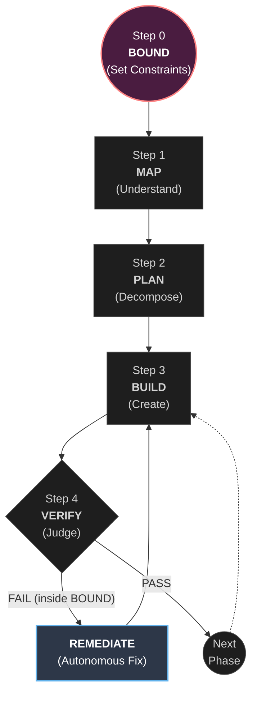

# Ouro Loop

**Ouro Loop** is an open-source framework that gives AI coding agents (Claude Code, Cursor, Aider, Codex) a structured autonomous loop with runtime-enforced guardrails. It implements **bounded autonomy** — the developer defines absolute constraints (DANGER ZONES, NEVER DO rules, IRON LAWS) using the BOUND system, then the agent loops autonomously through Build → Verify → Self-Fix cycles. When verification fails, the agent doesn't ask for help — it consults its remediation playbook, reverts, tries a different approach, and reports what it did.

> **"To grant an entity absolute autonomy, you must first bind it with absolute constraints."**

---

## Why Ouro Loop?

In the era of "vibe coding," unbound AI agents hallucinate file paths, break production constraints, regress architectural patterns, and get stuck in infinite fix-break loops. The current solution — pausing to ask humans — negates the promise of autonomous coding.

Ouro Loop solves this with **Precision Autonomy through Absolute Constraint**. Define the boundary. Release the agent. Sleep.

| | |
|---|---|
| **What it does** | Let AI agents code overnight without breaking things |
| **How it works** | Define boundaries (BOUND) → AI loops: Build → Verify → Self-Fix |
| **What you get** | `program.md` (method) + `framework.py` (runtime) + `sentinel.py` (24/7 review) + 5 hooks (enforcement) |
| **Requirements** | Python 3.10+, Git, any AI agent. Zero dependencies. |

---

## The Loop



When verification fails, the agent does **not** ask for human help. It consults `modules/remediation.md`, decides on a fix, reverts/retries, and loops — so long as it hasn't breached the outer edge of the BOUND.

---

## Quick Start

```bash
# Clone
git clone https://github.com/VictorVVedtion/ouro-loop.git ~/.ouro-loop

# Scan your project
cd /path/to/your/project
python ~/.ouro-loop/prepare.py scan .

# Initialize
python ~/.ouro-loop/prepare.py init .
python ~/.ouro-loop/prepare.py template claude .

# Edit CLAUDE.md with your BOUND, then launch your agent
```

[:material-rocket-launch: Full Quick Start Guide](guides/quick-start.md){ .md-button .md-button--primary }

---

## Key Concepts

- **[Bounded Autonomy](concepts.md#bounded-autonomy)** — Full agent freedom within rigid constraints
- **[BOUND System](concepts.md#bound-system)** — DANGER ZONES + NEVER DO + IRON LAWS
- **[Autonomous Remediation](concepts.md#autonomous-remediation)** — Detect → Decide → Act → Report
- **[Five Verification Gates](concepts.md#five-verification-gates)** — EXIST, RELEVANCE, ROOT_CAUSE, RECALL, MOMENTUM
- **[Runtime Enforcement](concepts.md#runtime-constraint-enforcement)** — Hooks that hard-block, not instructions that suggest

---

## Real Results

These results come from real Ouro Loop sessions on production codebases.

| Metric | Before | After | Delta |
|--------|--------|-------|-------|
| Precommit (under load) | 100-200ms | 4ms | **-98%** |
| Block time (under load) | 111-200ms | 52-57ms | **-53%** |
| TPS Variance | 40.6% | 1.6% | **-96%** |
| SysErr rate | 0.00% | 0.00% | = (IRON LAW) |

[:material-test-tube: See All Examples](examples/index.md){ .md-button }

---

## Is Ouro Loop For You?

**Yes, if:**

- You want to let an AI agent run autonomously for hours (overnight builds, long refactors)
- Your project has files that must never be touched without review (payments, auth, consensus)
- You've experienced AI agents hallucinating paths, breaking constraints, or getting stuck in loops
- You want auditable, structured autonomous development

**No, if:**

- You're building a quick prototype or hackathon project (BOUND setup overhead isn't worth it)
- You're writing single-file scripts (the methodology overhead exceeds the benefit)
- You want real-time interactive coding (Ouro Loop is designed for "set it and let it run")

---

## Works With

Ouro Loop is agent-agnostic. It works with any AI coding assistant that can read files and execute terminal commands:

- **[Claude Code](https://claude.ai/claude-code)** — Native `program.md` skill support + 4 enforcement hooks
- **[Cursor](https://cursor.sh)** — Use `.cursorrules` to reference Ouro Loop modules
- **[Aider](https://aider.chat)** — Terminal-based AI pair programmer
- **[Codex CLI](https://github.com/openai/codex)** — OpenAI's coding agent
- **[Windsurf](https://codeium.com/windsurf)** — Codeium's AI IDE
